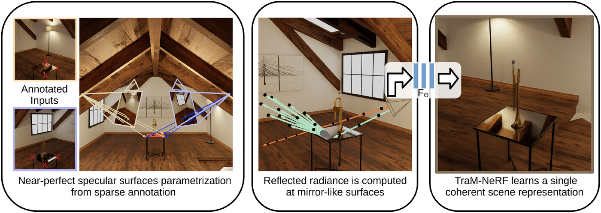

<h1 align="center" id="heading">:train: TraM-NeRF: Tracing Mirror and Near-Perfect Specular Reflections through Neural Radiance Fields</h1>

<p align="center">
    <p align="center">
		<b><a href="https://cg.cs.uni-bonn.de/person/m-sc-leif-van-holland">Leif Van Holland</a></b>
        &nbsp;·&nbsp;
		<b><a href="https://github.com/Rubikalubi">Ruben Bliersbach</a></b>
        &nbsp;·&nbsp;
		<b><a href="https://cg.cs.uni-bonn.de/person/m-sc-jan-uwe-mueller">Jan Müller</a></b>
        &nbsp;·&nbsp;
        <b><a href="https://cg.cs.uni-bonn.de/person/dr-patrick-stotko">Patrick Stotko</a></b>
        &nbsp;·&nbsp;
        <b><a href="https://cg.cs.uni-bonn.de/person/prof-dr-reinhard-klein">Reinhard Klein</a></b>
    </p>
    <p align="center">
        University of Bonn
    </p>
    <h3 align="center">Computer Graphics Forum 2024</h3>
    <h3 align="center">
        <a href="https://onlinelibrary.wiley.com/doi/10.1111/cgf.15163">Paper</a>
        &nbsp; | &nbsp;
        <a href="https://cg.cs.uni-bonn.de/publication/holland-2024-tram-nerf">Project Page</a>
		&nbsp | &nbsp;
        <a href="https://cg.cs.uni-bonn.de/backend/v1/files/code/TraM_NeRF/tramnerf_scenes.zip">Data</a>
    </h3>
    <div align="center"></div>
</p>

<p align="center">
    
</p>

This repository contains the official implementation of *[Holland et al. (CGF 2024): "TraM-NeRF: Tracing Mirror and Near-Perfect Specular Reflections through Neural Radiance Fields"](https://onlinelibrary.wiley.com/doi/10.1111/cgf.15163)*.

## Abstract

Implicit representations like neural radiance fields (NeRF) showed impressive results for photorealistic rendering of complex scenes with fine details. However, ideal or near-perfectly specular reflecting objects such as mirrors, which are often encountered in various indoor scenes, impose ambiguities and inconsistencies in the representation of the re-constructed scene leading to severe artifacts in the synthesized renderings. In this paper, we present a novel reflection tracing method tailored for the involved volume rendering within NeRF that takes these mirror-like objects into account while avoiding the cost of straightforward but expensive extensions through standard path tracing. By explicitly modelling the reflection behaviour using physically plausible materials and estimating the reflected radiance with Monte-Carlo methods within the volume rendering formulation, we derive efficient strategies for importance sampling and the transmittance computation along rays from only few samples. We show that our novel method enables the training of consistent representations of such challenging scenes and achieves superior results in comparison to previous state-of-the-art approaches.

## Citation

If you use the code for your own research, please cite TraM-NeRF as

```
@inproceedings{holland2024tram,
  title={TraM-NeRF: Tracing Mirror and Near-Perfect Specular Reflections Through Neural Radiance Fields},
  author={Holland, Leif Van and Bliersbach, Ruben and M{\"u}ller, Jan Uwe and Stotko, Patrick and Klein, Reinhard},
  booktitle={Computer Graphics Forum},
  doi = {10.1111/cgf.15163},
  year={2024},
  organization={Wiley Online Library}
}
```

## Installation

Make sure the following requirements are installed:
* Python >= 3.10
* CUDA >= 12.1
* C++17 compiler

Install depedencies:
```bash
pip install torch==2.4.0 torchvision==0.19.0 --index-url https://download.pytorch.org/whl/cu121
pip install -r requirements.txt
```

## Using an existing config file

We provide configuration files for all scenes used in the evaluation of the paper. These can be found in the ``experiments`` folder. The parameters were tested on a single NVIDIA A100 GPU. For less GPU memory usage, set ``Config.bsz`` to a lower value (default: 16384). To keep the same number of rays seen during training, ``Config.iterations`` should be increased accordingly.

### Data

The dataset we created consists of 11 synthetic scene with one or multiple mirrors, 5 synthetic scenes with near-perfect specular surfaces and 3 real-world scenes with mirrors. To allow for a comparison with methods that only support forward-facing scenes, three of the synthetic scenes have cameras placed on a single plane in the scene.

You can find the download link to the data [at the top of the README](#heading). Unpack the content of the zip file into a directory called `data` in the project root. For a description of the file format, see the section [Using your own data](#using-your-own-data) below.

<details>
<summary>List of all scenes</summary>

| name          		| type 		| forward-facing | non-zero roughness |
| ----					| ---- 		| ----			 | ----				  |
| scene_1				| synthetic | no			 | no				  |
| scene_2				| synthetic | no			 | no				  |
| scene_3				| synthetic | no			 | no				  |
| scene_4				| synthetic | no			 | no				  |
| scene_5				| synthetic | no			 | no				  |
| scene_9				| synthetic | no			 | no				  |
| scene_tram			| synthetic | no			 | no				  |
| scene_trumpet			| synthetic | no			 | no				  |
| scene_cylinder_synth	| synthetic | no			 | no				  |
| scene_6				| synthetic | no			 | yes				  |
| scene_7				| synthetic | no			 | yes				  |
| scene_12				| synthetic | no			 | yes				  |
| scene_trumpet_rough 	| synthetic | no			 | yes				  |
| scene_8				| synthetic | yes			 | no				  |
| scene_10				| synthetic | yes			 | yes				  |
| scene_11				| synthetic | yes			 | no				  |
| scene_hallway 		| real		| no			 | no				  |
| scene_library			| real		| no			 | no				  |
| scene_cylinder_real	| real		| no			 | no				  |
</details>

### Run train config

To run a config from the ``experiments`` folder, use
```
python run.py -config tramnerf_scene_1.gin
```
The training process will create checkpoints in a unique log folder inside ``logs/tramnerf/``. An events file, readable by TensorBoard, will also be generated in the log folder. To monitor the training process, you can use

```
tensorboard --logdir logs/tramnerf
```

### Render result

 To render the test views from the dataset after the training is finished, you can use
```
python test_render.py --run logs/tramnerf/<log_name>
```
The resulting renderings will be saved in ``results/<scene_name>/<log_name>``. The script accepts additional parameters. For examples, to reproduce the results on scenes containing specular surfaces with non-zero roughness, we set ``--num_ray_samples 50`` to produce the final renderings. See the script documentation for details.

### Evaluate result

After the test renderings are generated, the ``eval.py`` script can be used to compute the metrics we listed in the paper. Run
```
python eval.py --gt <path_to_scene>/test --images results/<scene_name>/<log_name>
```
and the respective results will be shown in the console. To evaluate the metrics only in mirror regions, use
```
python eval.py --gt <path_to_scene>/test --images results/<scene_name>/<log_name> --masks <path_to_masks>
```
We provide masks derived from the manual annotations for all scenes of our dataset in the ``masks`` folder that comes with the dataset.

## Using your own data

To use your own data for training, you first have to convert it to our modified Blender dataset format. For synthetic scenes, the dataloader we provide should be compatible with the default Blender dataset ``.json`` files, where only the focal length is given as ``camera_angle_x``. For real-world scenes, you can instead provide a full intrinsic matrix (see real-world scenes in our dataset for details). If you do not have any existing camera poses or intrinsics, we recommend to use [COLMAP](https://colmap.github.io/), because the additional scripts we provide support COLMAP's output directly.

Note that we rescale and recenter the coordinate system of the real-world scenes to cover a region closer to the origin with the whole scene. This is done manually in the config file. We provide a script that computes a bounding box of a sparse COLMAP reconstruction. It removes outliers using a quantile criterion to get a more accurate scaling factor. See ``get_colmap_bounding_box.py`` for details.

There is also a script that automatically converts the COLMAP output to the Blender dataset format. See ``colmap_to_blender.py`` for details.

### Annotations

In the paper we showed scenes with rectangular and cylindrical mirrors. These were annotated manually with different techniques depending on the type of mirror geometry. For our own dataset, the results of the annotation process can be found in the respective config files.

#### Planar mirrors

For planar mirrors, the geometry is parameterized as triangles. To produce annotations, we got the pixel coordinates of the corners of a mirror in two images, triangulated the respective 3D points using the known cameras and projected the resulting points onto the best plane fit using PCA. In the config file, a resulting annotation of a single quadrilateral mirror may look like this (taken from `tramnerf_scene_1.gin`):
```
TraMNeRF.mirrors = [
    {
        "type": "triangle",
        "points": [
            [-0.298863, 0.130243, 1.039],
            [-0.298863, 0.130243, 0.023521],
            [0.298863, 0.130243, 0.023521]
        ]
    },
    {
        "type": "triangle",
        "points": [
            [0.298863, 0.130243, 0.023521],
            [0.298863, 0.130243, 1.039],
            [-0.298863, 0.130243, 1.039]
        ]
    }
]
```

#### Cylindrical mirrors

For cylindrical mirrors, we generated masks from sparse annotations using *[Dröge et al. (ICIP, 2021) "Learning or Modelling? An Analysis of Single Image Segmentation Based on Scribble Information"](https://github.com/drgHannah/Single-Image-Segmentation-Based-on-Scribble-Information)*. After retrieving binary mask images for a small set of views, the ``fit_cylinder.py`` script can be used to derive cylinder parameters from the masks using the inverse rendering approach we described in the paper. See the script for details. A resulting annotation of a single cylinder may look like this (taken from `tramnerf_scene_m4.gin`):
```
TraMNeRF.mirrors = [
    {
        "type": "cylinder",
        "origin": [0.006725, -0.230915, 0.62847],
        "end": [0.006725, 0.127085, 0.62847],
        "radius": 0.179
    },
]
```

### Create a config file

Please refer to the existing config files as a template for your custom scene.

### Generate masks for evaluation

If you want to measure the evaluation metrics only in the mirror regions, you need binary masks for the mirror regions from every test view. To generate them, you can use any checkpoint from your custom training and invoke
```
python render_masks.py --run logs/tramnerf/<log_name>
```
The masks will be saved in ``results_masks/<scene_name>/``.

## Credit

This codebase builds upon incredible previous works, in particular [NeRF-Factory](https://github.com/kakaobrain/nerf-factory) and [NerfAcc](https://github.com/nerfstudio-project/nerfacc). Thanks to all the contributors for these great projects!

## Acknowledgements

This work has been funded by the DFG project KL 1142/11-2 (DFG Research Unit FOR 2535 Anticipating Human Behaviour), and additionally by the Federal Ministry of Education and Research of Germany and the state of North-Rhine Westphalia as part of the Lamarr-Institute for Machine Learning and Artificial Intelligence and by the Federal Ministry of Education and Research under Grant No. 01IS22094E WEST-AI.
